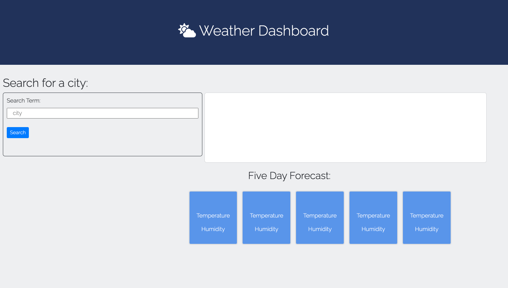
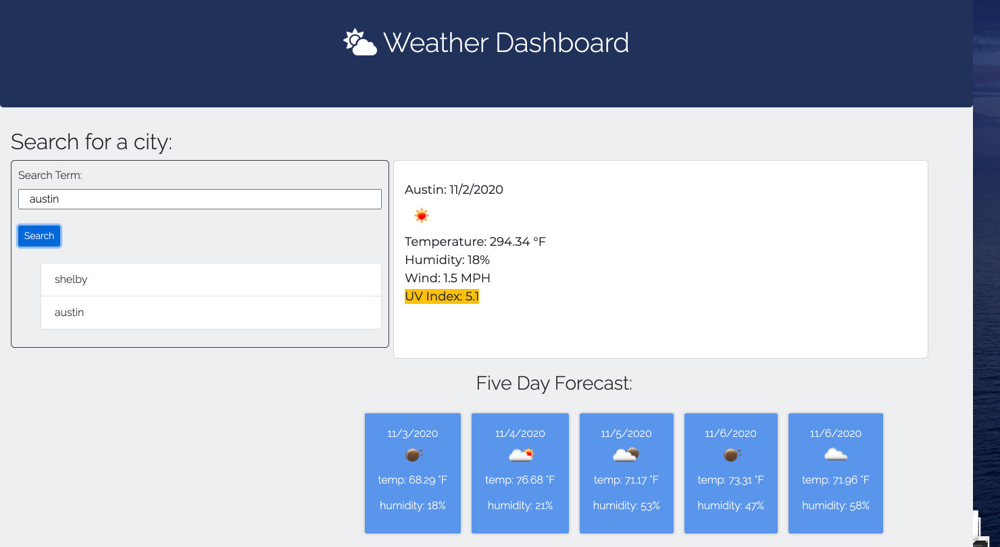

In this project, I created a weather dashboard where the user needs only to enter their desired city and click "search", to return the weather forecast for that city. I was able to get the weather forecast for the current day and next five days by using the Open Weather Map API. I used mainly JQuery and CSS and HTML to produce this. It dynamically responds and works on desktop browsers, as well as phones or tablets. In my screenshots below, you can see that once a few cities are searched it will store them in a list. 

Here is a link to my website: https://victoriahunter11.github.io/WeatherDashboard/

Here is a link to my repo: https://github.com/victoriahunter11/WeatherDashboard

An image of it before you search:

